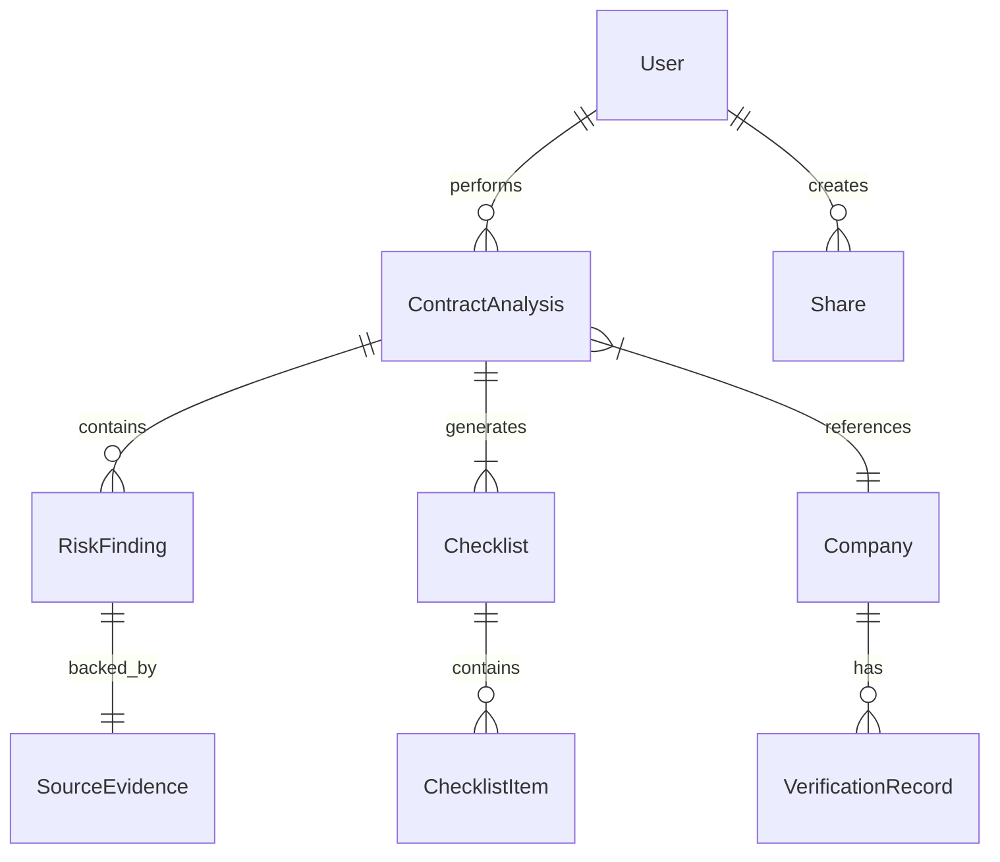

# AI Document Assistant: Student Contract Transparency, Agentic AI & Offline Voice Assistance

**Subtitle:** Technical Research, Solution Architecture, Development Roadmap and Prototype Documentation

**Version:** 1.0.0  
**Date:** 2026-08-28  
**Technology Stack:** Node.js, Python, Java, LLMs, OCR, Speech-to-Text, quantised local models  

## Executive Summary
The AI Student Contract Transparency & Action Assistant aims to help students understand potentially important financial and contractual obligations before committing to internships, jobs, training programs, or similar opportunities. 

The project combines AI document understanding, contract/offer-letter analysis, actionable checklist generation, agentic AI, a conversational chatbot, and voice assistance. It also features offline fallback, company verification, persistent saving, team sharing, and server status and recovery capabilities. By identifying potentially risky or unclear clauses, the system provides evidence-backed information and recommended questions/actions to ensure transparency and empower students in their decision-making.

## Problem Statement
Students often receive internship, job, or training agreements that contain important terms that are difficult to understand. These terms may include:
- Training fees, registration fees, certification fees
- Security deposits, post-selection payments, refund conditions
- Penalties, bonds, minimum commitments, notice periods
- Salary/stipend conditions, deductions, termination clauses
- Other complex contractual obligations

Without proper guidance, students may not fully understand these terms before accepting an opportunity, leading to unexpected financial or professional burdens.

A secondary problem is that cloud-dependent AI assistance can become unavailable due to internet failure, server downtime, API failure, or network instability. Thus, robust offline fallback assistance is a core area of research in this project to ensure continuous accessibility.

## Proposed Solution
The proposed solution addresses the problem through the following pipeline:

`Student` ↓ `Upload / Scan Contract` ↓ `Document Extraction` ↓ `AI Contract Analysis` ↓ `Risk & Obligation Extraction` ↓ `Company Verification` ↓ `Evidence Cross-Check` ↓ `Student-Friendly Report` ↓ `Action Checklist` ↓ `Agentic Guidance` ↓ `Chatbot + Voice Assistant` ↓ `Save` ↓ `Team Sharing`

**Explanation of Stages:**
- **Upload / Scan Contract:** The student inputs the document.
- **Document Extraction & AI Analysis:** Information is extracted and analyzed using AI.
- **Risk & Obligation Extraction:** Potential financial and legal obligations are highlighted.
- **Company Verification & Evidence Cross-Check:** Company details are checked against primary sources and mapped to evidence in the text.
- **Report & Checklist:** A friendly report and actionable checklist are generated.
- **Agentic Guidance & Assistance:** A chatbot/voice assistant guides the student through next steps.
- **Save & Team Sharing:** State is preserved and can be shared with peers or mentors.

## Existing Working System
*(Note: As verified by repository inspection, the project is currently in the initial setup and research phase. No existing application code was found. All features below are in the planned or research stages.)*

- **Document upload:** [PLANNED]
- **AI processing:** [PLANNED]
- **Checklist generation:** [PLANNED]
- **Chatbot:** [PLANNED]
- **Save functionality:** [PLANNED]
- **Team sharing:** [PLANNED]
- **Node.js server:** [PLANNED]
- **Python modules:** [PLANNED]
- **Java modules:** [PLANNED]
- **Existing voice functionality:** [PLANNED]

## Technical Stack

| Component | Technology | Purpose | Status |
|-----------|------------|---------|--------|
| **Frontend** | React / Vue (TBD) | User Interface | PLANNED |
| **Backend** | Node.js | API & Application Logic | PLANNED |
| **Data Processing** | Python | Advanced NLP & AI processing | PLANNED |
| **Enterprise Integration**| Java | Potential enterprise/legacy integration | PLANNED |
| **LLM** | OpenAI API / Local | Natural language understanding | PLANNED |
| **Database** | PostgreSQL / MongoDB | Data persistence | PLANNED |
| **Document Processing**| Tesseract / PyMuPDF | OCR and text extraction | RESEARCH |
| **Speech-to-Text** | Whisper / whisper.cpp | Voice recognition | RESEARCH |
| **Text-to-Speech** | Browser TTS / Coqui | Voice generation | RESEARCH |
| **Agentic Framework** | LangChain / Custom | Agent workflow orchestration | RESEARCH |
| **Local Inference** | llama.cpp / Ollama | Offline fallback AI | RESEARCH |
| **Cloud AI** | AWS / GCP / Azure | Online AI compute | PLANNED |
| **Deployment** | Docker / Kubernetes | Application hosting | PLANNED |

## Offline Voice Research
To address connectivity limitations, an offline voice architecture is researched.

**Online Architecture:**  
`Microphone` ↓ `Speech-to-Text` ↓ `Cloud AI / Existing Chatbot` ↓ `Text-to-Speech` ↓ `Speaker`

**Offline Fallback Architecture:**  
`Microphone` ↓ `Local Speech-to-Text` ↓ `Local AI / Checklist Logic` ↓ `Local Text-to-Speech` ↓ `Speaker`

**Technologies Researched:**
- **whisper.cpp for offline STT:** [RECOMMENDED] Efficient local C++ implementation.
- **llama.cpp for local inference:** [RECOMMENDED] Enables running quantized models efficiently.
- **Ollama as a local option:** [EXPERIMENTAL] Useful for local development and simplified model management.
- **Quantized local models:** [RECOMMENDED] Essential for performance on low-end hardware.
- **Browser/OS/local TTS:** [RECOMMENDED] Readily available without heavy dependencies.
- **Coqui TTS:** [FUTURE] For higher quality, natural-sounding voices.

## Agentic AI Research
A simple chatbot is insufficient for structured task guidance. The system requires an Agentic AI workflow:

`User Goal` ↓ `Understand` ↓ `Plan` ↓ `Choose Action` ↓ `Execute` ↓ `Update Checklist` ↓ `Verify` ↓ `Next Action`

**Possible Agent Tools:**
- `analyze_document()`
- `extract_contract_clauses()`
- `detect_payment_terms()`
- `detect_penalties()`
- `detect_bond_terms()`
- `detect_notice_period()`
- `detect_missing_information()`
- `get_company_information()`
- `retrieve_source_evidence()`
- `create_student_questions()`
- `create_checklist()`
- `update_checklist()`
- `get_next_pending_task()`
- `generate_risk_report()`

*Important:* The LLM will NOT have direct, uncontrolled access to perform database operations. It will only utilize tools with predefined boundaries.

## Contract Analysis Design
The structured analysis will break down findings as follows:

- **Category:** e.g., financial, legal, operational
- **Description:** Explanation of the clause
- **Severity:** low, medium, high
- **Evidence:** Exact text snippet
- **Page/section:** Location in document
- **Confidence:** AI confidence score (0.0 - 1.0)
- **Recommended action:** Actionable step for the student

**Example JSON Finding:**
```json
{
  "category": "financial",
  "finding": "Potential payment obligation detected",
  "severity": "medium",
  "evidence": "Relevant contract clause",
  "page": 3,
  "confidence": 0.91,
  "recommended_action": "Ask the organization whether the payment is mandatory and refundable."
}
```
*Note:* The AI system will NOT automatically label any organization as fraudulent. It provides objective analysis of text.

## Company Verification Research
Company verification relies on primary sources (government databases, regulatory bodies) with secondary sources providing context.

**Data Attributes:**
- Company name
- Legal/company identifier
- Registration status
- State
- Registration authority
- Official website
- Source
- Source URL
- Verification date
- Verification status

**Verification Nuance:**
Company verification is distinct from contract risk analysis.
"Company registration information was found" is NOT equivalent to "This company is safe."

## Data Architecture



**Additional Considerations:**
- Source tracking for all assertions
- Verification dates strictly logged
- Exact Source Evidence mapping
- Versioning for both Documents and Analyses
- Secure data persistence and share permissions

## Save & Team Sharing
**Workflow:**
`Save Checklist` ↓ `Generate Checklist ID` ↓ `Store document + analysis + checklist + progress` ↓ `My Saved Checklists` ↓ `Open saved checklist` ↓ `Share` ↓ `Generate secure Share ID / URL` ↓ `Team Member opens shared checklist`

**Permissions:**
- **OWNER:** View, Edit, Save, Share
- **TEAM MEMBER:** View, Chat, Voice Assistant, View checklist, Follow tasks

*(Note: Collaborative editing/synchronization is considered future/advanced work.)*

## Server Health & Recovery
**Health Endpoint:** `GET /api/health`

**Expected States:**
- 🟢 Server Online
- 🟡 Reconnecting
- 🔴 Server Offline

**Recovery Workflow:**
`Server unavailable` ↓ `Detect failure` ↓ `Notify user` ↓ `Switch to local/basic assistance` ↓ `Internet/server restored` ↓ `Resume online mode`

*Voice message example:* "The server is currently unavailable. I'm switching to offline mode."

## Complete System Architecture

```text
              AI DOCUMENT ASSISTANT
                       │
   ┌───────────────────┼───────────────────┐
   │                   │                   │
DOCUMENT             AGENT               TEAM
   │                   │                   │
Upload / Scan    Planner / Tools    Save / Share
   │                   │                   │
   ▼                   ▼                   ▼
AI Processing   Execute / Verify    Collaboration
   │                   ▼                   │
Contract Analysis      │                   │
   │                   │                   │
   └──────────┬────────┘                   ▼
          CHECKLIST                        │
              ▼                            │
       VOICE ASSISTANT                     │
   ┌─────────┴─────────┐                   │
   │                   │                   │
ONLINE              OFFLINE                │
Cloud AI            Local AI               │
   └─────────┬─────────┘                   ▼
       User Guidance
```

## Development Roadmap

- **Phase 1 — Existing System Freeze:** [PLANNED] Set up foundational repo, structure, and docs.
- **Phase 2 — Voice Assistant MVP:** [PLANNED] Basic online STT/TTS interaction.
- **Phase 3 — Offline Voice Layer:** [PLANNED] Integrate local whisper/llama capabilities.
- **Phase 4 — Agentic AI Layer:** [PLANNED] Implement LangChain/Custom agent tools.
- **Phase 5 — Document Context:** [PLANNED] Complete OCR and text extraction pipelines.
- **Phase 6 — Error & Recovery:** [PLANNED] Build robust network failure transitions.
- **Phase 7 — Team Collaboration:** [PLANNED] Enable sharing and read-only teammate views.
- **Phase 8 — Product Polish:** [PLANNED] UI/UX improvements and responsive design.
- **Phase 9 — Testing Matrix:** [PLANNED] Comprehensive unit and integration testing.
- **Phase 10 — Deployment & Demo:** [PLANNED] Hosting and final presentations.

## Testing Matrix

| Situation | Expected Result | Status |
|-----------|-----------------|--------|
| Internet ON | Normal cloud-based operations | NOT TESTED |
| Internet OFF | Switch to local inference mode | NOT TESTED |
| Server DOWN | Switch to local fallback mode | NOT TESTED |
| Internet restored | Auto-resume cloud operations | NOT TESTED |
| Mic denied | Graceful failure, prompt text input | NOT TESTED |
| Long document | Paginated or batched AI processing | NOT TESTED |
| Checklist update | State saved accurately in DB | NOT TESTED |
| Team link | View-only/Team access correctly enforced | NOT TESTED |
| Saved checklist | Loads historical state successfully | NOT TESTED |
| AI failure | Helpful error message provided | NOT TESTED |
| Database failure | Caches locally, alerts user | NOT TESTED |
| Invalid document | Rejects gracefully with instructions | NOT TESTED |
| Company source unavailable| Skips external verification gracefully | NOT TESTED |

## Hackathon Demo Flow
1. Student uploads contract.
2. AI analyzes it.
3. Potential payment clause is detected.
4. Evidence is displayed.
5. Company information is checked.
6. Risk/clarification report is generated.
7. Checklist is created.
8. Student asks chatbot.
9. Student uses voice assistant.
10. Checklist progress changes.
11. Analysis is saved.
12. Share link is generated.
13. Team member opens it.
14. Internet is disconnected.
15. Offline fallback is demonstrated.
16. Internet reconnects.
17. Online mode resumes.

*(Note: Currently entirely conceptual/planned. Not yet functional for demo.)*

## Innovation
**Core Innovation:**
- Document-to-action workflow
- Agentic task guidance
- Evidence-backed contract analysis
- Offline fallback capabilities
- Voice interaction

**Product Polish Features:**
- Student-friendly explanations
- Company verification
- Persistent checklist state
- Team collaboration

## Limitations
- AI analysis is not legal advice.
- Company registration does not guarantee trustworthiness.
- External verification depends on source availability.
- Offline mode has limited capabilities compared to cloud AI.
- AI may require human verification for complex clauses.
- Fresh online company verification is unavailable offline.
- Advanced conflict-free synchronization for collaboration is future work.

## Future Scope
- Better local LLM integration
- Better offline STT models
- Natural local TTS
- Multilingual Indian-language voice
- Improved company verification
- Source credibility scoring
- More regulatory integrations
- Advanced collaboration (multi-edit)
- Offline-to-online synchronization
- Mobile application
- Browser extension
- Automated contract comparison
- Historical clause analysis
