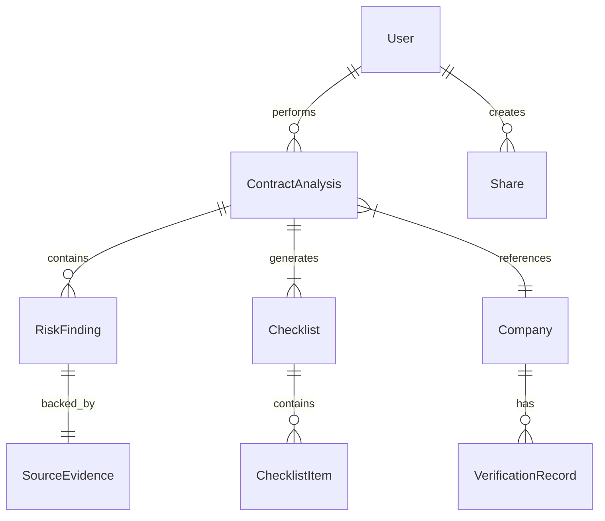

# System Architecture

## Complete System Architecture

```text
              AI DOCUMENT ASSISTANT
                       │
   ┌───────────────────┼───────────────────┐
   │                   │                   │
DOCUMENT             AGENT               TEAM
   │                   │                   │
Upload / Scan    Planner / Tools    Save / Share
   │                   │                   │
   ▼                   ▼                   ▼
AI Processing   Execute / Verify    Collaboration
   │                   ▼                   │
Contract Analysis      │                   │
   │                   │                   │
   └──────────┬────────┘                   ▼
          CHECKLIST                        │
              ▼                            │
       VOICE ASSISTANT                     │
   ┌─────────┴─────────┐                   │
   │                   │                   │
ONLINE              OFFLINE                │
Cloud AI            Local AI               │
   └─────────┬─────────┘                   ▼
       User Guidance
```

## Data Architecture



## Offline Voice Architecture

**Online:**
`Microphone` ↓ `Speech-to-Text` ↓ `Cloud AI / Existing Chatbot` ↓ `Text-to-Speech` ↓ `Speaker`

**Offline Fallback:**
`Microphone` ↓ `Local Speech-to-Text` ↓ `Local AI / Checklist Logic` ↓ `Local Text-to-Speech` ↓ `Speaker`

## Save & Team Sharing Flow
`Save Checklist` ↓ `Generate Checklist ID` ↓ `Store document + analysis + checklist + progress` ↓ `My Saved Checklists` ↓ `Open saved checklist` ↓ `Share` ↓ `Generate secure Share ID / URL` ↓ `Team Member opens shared checklist`

## Agentic AI Workflow
`User Goal` ↓ `Understand` ↓ `Plan` ↓ `Choose Action` ↓ `Execute` ↓ `Update Checklist` ↓ `Verify` ↓ `Next Action`

## Server Health & Recovery
`Server unavailable` ↓ `Detect failure` ↓ `Notify user` ↓ `Switch to local/basic assistance` ↓ `Internet/server restored` ↓ `Resume online mode`
